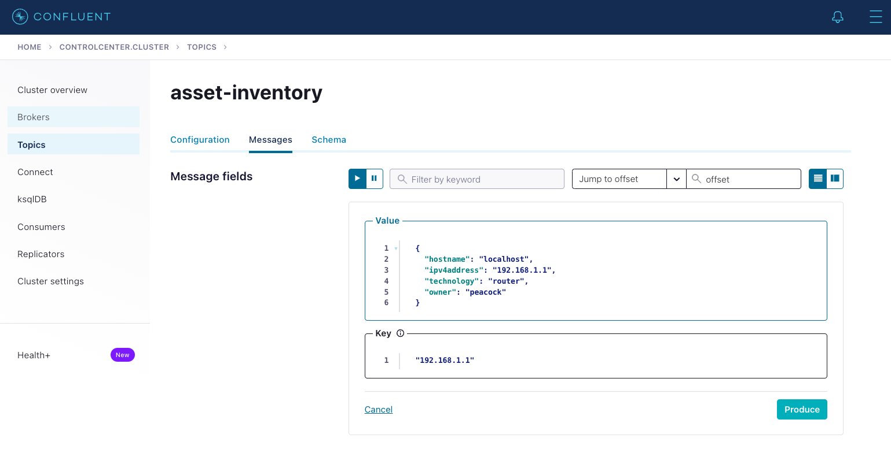

# Getting Started

The syslog-router-ktable application is a Kafka Streams application that take an input topic from the 
Confluent Syslog Connector and routes the data to sub-topics based on a lookup value in a ktable.
Additionally, you have the option to add any custom fields to the routed topic data.

There are two configuration files that need to be updated for your environment: `application.properties`
and `routingconfig.yaml`. Both files are located in the `config` directory.

### Application Configuration
The `application.properties` file contains all the properties specific to the application including broker settings, schema registry, and security settings.

```properties
application.id=syslog-router-app
bootstrap.servers=localhost:9092
schema.registry.url=http://localhost:8081

# Security Settings
security.protocol=SSL
ssl.truststore.location=/etc/security/tls/kafka.client.truststore.jks
ssl.truststore.password=test1234
ssl.keystore.location=/etc/security/tls/kafka.client.keystore.jks
ssl.keystore.password=test1234
ssl.key.password=test1234
```

The following fields should be modified for your environment:
* `boostrap.servers` - list of comma separated Confluent brokers
* `schema.registry` - schema registry URL and port
* security settings

### Routing Configuration
The `routingconfig.yaml` file contains a list of topic settings, field mappings to rename fields, and additional custom fields to be added to the output topic. The input topic settings include a list of input topics (`inputTopics`), input topic format (AVRO or JSON) (`inputTopicFormat`), input ktable topic name (`inputTableTopic`), and the field used for comparison of the topic to the ktable (`inputTopicComparField`). The output topic settings include a pre-prended name (`outputTopicFormat`), a field to be used to append to the topic (`outTopicAppendField`), a default append name if a match is not found (`outputTopicAppendUnknown`), and a optional comma separated list of names to be included in the output topic (`outputTopicIncludeFields`). You can also output all of the attribute, if desired (`outputAllFields`).

```yaml
topic:
  settings:
    inputTopics: "syslog" #list of input topics
    inputTopicFormat: "json" #json or avro
    inputTableTopic: "asset-inventory"
    inputTopicCompareField: "remoteAddress"

    outputTopicFormat: "syslog-" #format of output topic
    outputTopicAppendField: "technology" #field from input table to append to output topic
    outputTopicAppendUnknown: "unknown" #name to append to output topic when match is not found
    outputTopicIncludeFields: "owner" #comma separated fields to add from the input table
    outputAllFields: false
```


The field mappings are optional and contain a list of name/value pairs that will be used to remap the fields of the output topic. If you do not want to include any custom fields, this section of the configuration file can be removed.

Items within the list are separated by the dash (`-`) symbol. To add a new custom field, add a 
`-` followed by a name/value pairing. Example:

```yaml
fieldmapping:
  mappings:
    -
      currentName: "rawMessage"
      mappedName: "event.original"
    -
      currentName: "remoteAddress"
      mappedName: "log.syslog.hostname"
```

The custom fields are optional and contain a list of name/value pairs that will be added to the output topic. If you do not want to include any custom fields, this section of the configuration file can be removed.

Items within the list are separated by the dash (`-`) symbol. To add a new custom field, add a 
`-` followed by a name/value pairing. Example:

```yaml
custom:
  customFields:
    -
      name: "myNewField"
      value: "myNewValue"
```


***!!! IMPORTANT: All output topics, including the default output topic, should be created prior to running the streams application !!!***


### K-Table Setup
The ktable is used as a lookup to determine how the output topic should be routed. For instance, you could do a match on the IP address fields in the ktable and the syslog topic. If a match is found, the message would get routed to an output topic based on a field in the ktable defined by `outputTopicAppendField`.

The ktable can be set up using the ksql editor in the Confluent Control Center. The query below will create a table (and topic) called `asset-inventory`. There are a couple of key settings in the ktable. The `PRIMARY KEY` field is the field to be used for comparison with the syslog topic. Also, the format is JSON and the number of partitions need to match the syslog topic partitions. 

```properties
#Create Asset Inventory TABLE; partitions need to match syslog
CREATE TABLE `asset-inventory` (
  `hostname` VARCHAR,
  `ipv4address` VARCHAR PRIMARY KEY,
  `technology` VARCHAR,
  `owner` VARCHAR)
WITH (KAFKA_TOPIC='asset-inventory',
  PARTITIONS=5,
  VALUE_FORMAT='JSON',
  KEY_FORMAT='JSON');
  ```

The ktable topic can be populated by producing to the topic a number of ways. The easiest way may be using the Confluent Control Center. Example ktable input:

```json
{
  "hostname": "localhost",
  "ipv4address": "192.168.1.1",
  "technology": "router",
  "owner": "peacock"
}
```



For this example, if the `remoteAddress` matches the primary key in the table `ipv4address`, then the topic would get routed to the `syslog-router` topic based on the `technology` field.


### Running the Application
There is a script called `kstreams-router.sh` that will launch the Kafka Streams application. It is
configured to read the configuration files in the `config` directory. To run the application:

````
./kstreams-router.sh
````

***Note: if you are running the script from a remote directory, you may need to update the 
`SPRING_CONFIG_LOCATION` variable in the script to give the absolute path (i.e. replace `$PWD`).***